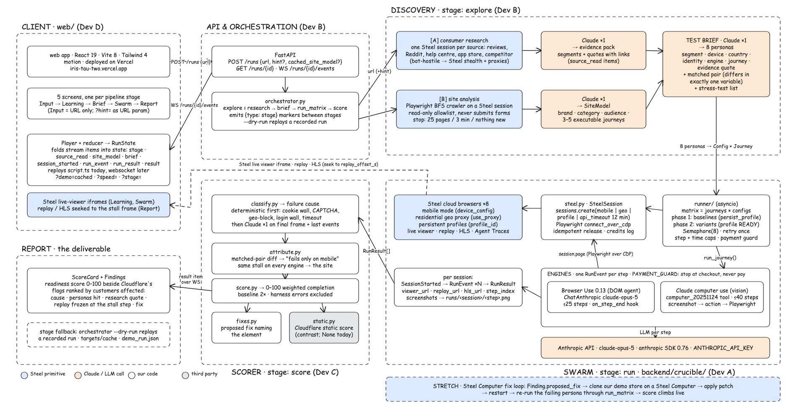

# Iris

**Send your customers in first.**

Iris replaces the paid case study. Point it at a company's URL with zero context and it researches who that
company's real customers are, maps what the live site lets them do, builds eight evidence-backed AI personas,
sends them through the site at once on real cloud browsers (mobile, returning, other countries, different kinds
of agent), and hands back a readiness score plus a ranked list of flags, each with the customer quote that
predicted it, the replay frozen on the frame where the agent gave up, and a concrete fix.

Built for the Battle of the Schools hackathon, **Steel.dev Web Agents track**. Front end: https://iris-tau-two.vercel.app



---

## Overview

Companies pay agencies for case studies and user research to learn how customers behave on their site.
"Agent readiness" tools (Cloudflare, Apify) only check static signals like `robots.txt` and `llms.txt` and never
run anything. Single-agent auditors (DataDab, Agent Checker) send one generic agent to the homepage with fixed
tasks and email a PDF. Iris does the thing neither does: it learns who the customers are and then **measures**
the site with a controlled population of real agents.

The pipeline is five stages, and the UI is one vertical page that grows as each stage completes:

| Stage | What happens | Where |
|---|---|---|
| **Input** | One field: the URL. No task list, no logins. | `web/` |
| **Learning** | Two agents run in parallel. *Consumer research* opens review sites, Reddit, help centres and a competitor in Steel sessions and produces an evidence pack of real quotes. *Site analysis* is a read-only crawler that maps the live site into 3 to 5 executable journeys. | `backend/crucible/explore/` (in progress) |
| **Test brief** | One Claude call turns evidence + site map into 8 personas (segment, device, country, identity, goal, supporting quote) and a stress-test list. Two personas are a matched pair differing in exactly one variable. | `backend/crucible/` (in progress) |
| **Swarm** | Eight Steel sessions at once. Each persona gets its own mobile fingerprint, residential geo proxy, and persistent profile. A DOM agent or a vision agent runs the goal and narrates every step. Agents never submit payment. | `backend/crucible/runner/`, `engines/`, `steel.py` |
| **Report** | Every stall is classified into a fixed failure taxonomy, attributed to a single variable, matched to the research quote that predicted it, and given a proposed fix. Ranked by customers affected. | `backend/crucible/scorer/` |

**The rule that keeps it honest:** research supplies *what to test*, never *the answer*. A flag is only reported
if an agent actually reproduced it. Tooling failures (session did not start, model timed out, browser
disconnected) are bucketed as harness errors, shown grey, and excluded from the score.

Full reasoning per screen is in `docs/ui-flow.md`; the original concept and prior-art table is in `docs/concept.md`.

---

## Key features

**Controlled experiment, not a swarm.** Every run config differs from the baseline (desktop, fresh profile,
US, DOM agent) in exactly one variable, enforced at matrix-build time. That is what makes a stall attributable:
"fails only on mobile", "fails only from Germany", "fails for every kind of agent, so it is the site".

**Steel primitives used as product features, not plumbing.**
- Mobile mode with a full device fingerprint (`device_config`), not a spoofed user agent.
- Residential geo proxies per persona (`use_proxy.geolocation`), so country is the only thing that differs.
- Persistent Profiles: the baseline run warms a profile, the returning persona launches from its `profile_id` and arrives with cookies and cart.
- Live viewer embed per session in the swarm grid, and session replay seeked to the stall frame in the report.

**Two agent engines on one session interface.** Browser Use (DOM agent) and Claude computer use (vision agent)
both implement `run_journey()` and emit the same `RunEvent` stream, so the Runner is engine-agnostic. A stall
that hits every engine is flagged `engine_consensus`.

**Deterministic scoring with LLM only where needed.** Cookie walls, CAPTCHAs, geo-blocks, login walls and
timeouts are detected from the final page and events; one Claude call classifies the remainder. Fixes are
generated from the category plus the offending element pulled from the event trail. The whole scorer runs
on fixtures with no keys.

**A front end that plays without a backend.** The React app folds a stream of typed items into state through
a pure reducer. Today a Player replays an authored script; a websocket can replace it without touching a screen.
That is also the stage fallback: if Steel or the network dies on stage, the show still runs.

### Metrics

| | |
|---|---|
| Concurrent Steel sessions per wave | 8 (Steel free-tier cap is 10, two held for retries) |
| Run configs defined | 4 MVP · 6 should · 7 stretch, all one-variable-from-baseline |
| Agent engines | 2 live-verified (Browser Use, Claude computer use), 1 defined (OpenAI computer use) |
| Failure taxonomy | 11 categories · 5 attribution axes |
| Live runs verified on Steel | Browser Use baseline journey completed · Claude CU baseline completed · 3-config wave (baseline, mobile, returning) all completed |
| Backend tests | 102 passing in ~1 s, zero credits, zero keys |
| Front-end tests | 20 unit tests across 17 files, plus a Playwright end-to-end run that plays all 5 stages and screenshots each |
| Per-session budget | 12 min wall clock, 25-step cap for DOM agent, 40 for vision, 120 s inactivity release |
| Front end | React 19, Vite 8, Tailwind 4, deployed on Vercel |

Resume-style, one line each:

- Designed and built a controlled-population agent-readiness auditor that runs 8 concurrent cloud browser sessions on Steel with per-persona mobile, geo-proxy and persistent-profile configuration, attributing every failure to a single variable.
- Implemented two agent engines (Browser Use DOM agent, Claude computer-use vision agent) behind one async streaming interface, with step caps, inactivity release, retry-once, and a payment guard.
- Built a deterministic-first failure classifier with an 11-category taxonomy, matched-pair attribution, engine-consensus detection, and template-based fix generation, covered by 102 unit tests that need no API keys.
- Shipped a fixture-driven React front end whose five-stage show runs from a pure reducer, verified end to end with Playwright, deployable to Vercel.

---

## Repo layout

```
backend/                Python 3.12                                             (Devs A, B, C)
  crucible/schemas.py     shared contracts: SiteModel, Config, RunEvent, RunResult, Finding, ScoreCard
  crucible/steel.py       Steel session lifecycle: create → CDP → idempotent release, credits log, --list / --release-all
  crucible/engines/       base (interface), browser_use, claude_cu, fake, guard (payment guard)
  crucible/runner/        matrix (journeys × configs), wave scheduler, profile warm-up, retries, CLI
  crucible/scorer/        classify, attribute, score, fixes, static contrast
  crucible/testing.py     fakes for tests and dry runs
  fixtures/               example JSON for every schema + demo_run.json
  tests/                  pytest, no credits needed
  scripts/                spikes + fixture generator
  runs/                   event logs and screenshots from live runs, credits.log
web/                    Vite + React + Tailwind front end                      (Dev D)
  src/state/              player, reducer, usePlayer
  src/screens/            Input, Learning, Brief, Swarm, Report
  src/data/               authored Iris demo fixture + choreography script
  e2e/                    Playwright show run with per-stage screenshots
docs/                   concept, ui-flow, design-brief, api (stream contract), plan, diagrams
design/                 Claude Design exports and extraction notes
```

---

## Setup

You need Node 20+ and Python 3.12. [`uv`](https://docs.astral.sh/uv/) is used for the Python venv.

### 1. Backend

```bash
cd backend
uv venv --python 3.12 .venv
uv pip install --python .venv/bin/python -e ".[dev]"
.venv/bin/python -m playwright install chromium     # only for local, credit-free work
cp .env.example .env                                 # fill in keys below
.venv/bin/python -m pytest -q                        # 102 passed, no keys needed
```

Python 3.12 is required. The schemas use `list[str]` and `X | None` annotations, so an older interpreter on
your PATH (a conda 3.8, for example) fails at import with a pydantic `TypeError`. Always run through
`.venv/bin/python`, never bare `python`.

### 2. Front end

```bash
cd web
npm install
npm run dev          # http://localhost:5173, plays the authored demo
npm test             # vitest
npm run e2e          # builds, previews on :4173, plays the show, screenshots into e2e/screens/
npm run build
```

URL parameters for rehearsal: `?speed=6` plays the show faster, `?stage=run` seeks to a stage marker
(`explore`, `run`, `score`, `done`), `?demo=cached` shows the cached-mode pill. Deploy with
`vercel --prod --yes`; `vercel.json` pins the Vite build.

### 3. Keys

| Key | Used by | Needed for |
|---|---|---|
| `STEEL_API_KEY` | `crucible/steel.py` | Any live session: Runner without `--fake`, spikes, Explore on a real site |
| `ANTHROPIC_API_KEY` | Browser Use engine (`ChatAnthropic`), Claude CU engine, scorer classifier, Explore summariser, brief generation | Any live run, plus the LLM pass in `score()` and `explore()` |
| `ANTHROPIC_WORKSPACE_ID` | Anthropic client | Only for org-level keys not scoped to a workspace |
| `OPENAI_API_KEY` | `engines/openai_cu.py` (stretch) | Only if the third engine is built |

Tests, fixtures, and the whole front end need **no keys**. Residential geo proxies on Steel require a paid
balance; mobile mode and profiles work on the free tier.

### 4. Run the backend

All commands from `backend/`.

```bash
# No credits: fake engine, full matrix, events to stdout
.venv/bin/python -m crucible.runner --url https://x --journey "Add a product to the cart" --fake --configs mvp

# Live, one Steel session, DOM agent
.venv/bin/python -m crucible.runner --url https://x --journey "..." --configs baseline --step-cap 12

# Live, vision agent
.venv/bin/python -m crucible.runner --url https://x --journey "..." --configs baseline --engine claude_cu

# Live, full MVP matrix from a saved site model, events to a file
.venv/bin/python -m crucible.runner --site-json targets/cache/shop.json --configs mvp --out runs/events.jsonl

# Session housekeeping
.venv/bin/python -m crucible.steel --list            # live sessions
.venv/bin/python -m crucible.steel --release-all     # panic button

# Regenerate fixtures after a schema change (tell the whole team)
.venv/bin/python scripts/make_fixtures.py
```

Ctrl-C on a live run releases every session before exiting. Every real session appends a line to
`runs/credits.log`; fake runs do not.

---

## Contracts

Every module talks through `backend/crucible/schemas.py`. The four seams:

- `Engine.run_journey(session, journey, cfg, step_cap, ctx) -> AsyncIterator[RunEvent]` — `crucible/engines/base.py`
- `run_matrix(site, configs, engines) -> AsyncIterator[RunEvent | SessionStarted | RunResult]` — `crucible/runner/__init__.py`
- `score(site, results) -> (ScoreCard, list[Finding])` — `crucible/scorer/__init__.py`
- `explore(url, hint=None) -> SiteModel` — `crucible/explore/__init__.py` (in progress)

Pipeline items carry a `type` field. Backend items are `stage`, `session_started`, `run_event`, `run_result`.
The front end additionally consumes `source_read`, `site_model`, `brief`, and `result`; the full stream
contract and expected ordering is in `docs/api.md`.

Working rules: every fixture validates against its schema class, `fixtures/config.json` is a list of configs,
and schema changes need everyone in the room. Live runs and the Steel credit budget belong to Dev A; do not run
the Runner without `--fake` unless you have been handed a session budget.

---

## Status

| Piece | State |
|---|---|
| Steel session wrapper, Runner, matrix, wave scheduler | Done, live-verified |
| Browser Use engine, Claude computer-use engine | Done, each completed a live journey on Steel |
| Scorer: classify, attribute, score, fixes | Done, on fixtures |
| Cloudflare static-score contrast | Fallback only; no confirmed public endpoint, panel hides when `None` |
| Front end: five screens, player, reducer, e2e | Done, deployed |
| Consumer research + site explorer | In progress |
| Test-brief generation (8 personas, matched pair) | In progress |
| FastAPI + websocket, orchestrator, `--dry-run` | In progress |
| OpenAI computer-use engine, Steel Computer fix loop | Stretch |

Docs: `docs/ui-flow.md` (what each screen does and why) · `docs/design-brief.md` (look and motion) ·
`docs/api.md` (stream contract) · `docs/plan.md` (team plan) · `docs/dev-a-plan.md` (Steel core plan) ·
`docs/concept.md` (pitch and prior art).
